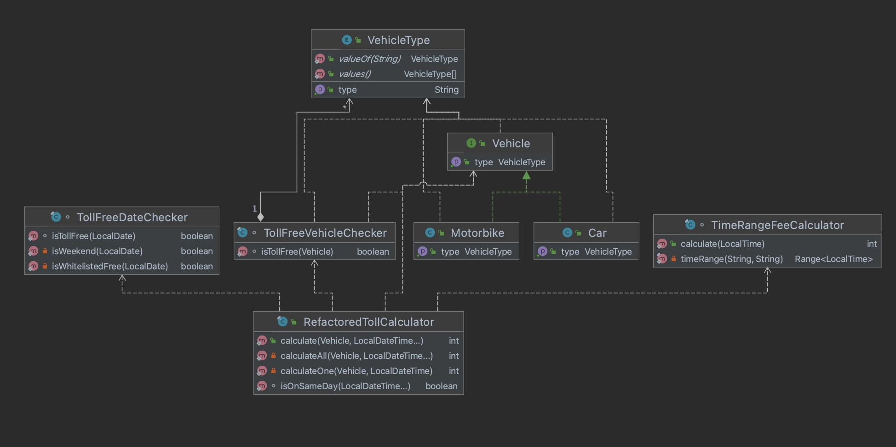

# TollFee Calculator

This toll calculator is implemented to calculate the congestion tax in Gothenburg region .
Congestion tax is charged during fixed hours for vehicles driving into and out of Gothenburg.
#### The maximum amount per day and vehicle is 60 SEK.
#### The tax is not charged on public holidays, days before a public holiday and during the month of July. Read more about Congestion taxes of Göteborg city referring to below links -

https://www.transportstyrelsen.se/sv/vagtrafik/Trangselskatt/Trangselskatt-i-goteborg/Tider-och-belopp-i-Goteborg/dagar-da-trangselskatt-inte-tas-ut-i-goteborg/

https://www.transportstyrelsen.se/sv/vagtrafik/Trangselskatt/Undantag-fran-trangselskatt/
## Solution
## Class Diagram
This is a class diagram for toll calculator which shows the class dependencies.



## Getting started
This application can be run directly or via Maven.
### How it was solved
* Create a maven project, create some tests and make sure the refactored version of the toll calculator passes All the tests
* Simplify and refactor what's tricky to interpret, e.g. the time range and the calculation logic by using more recent Date API and Google Guava library to handle ranges
* Split logic in different classes (could have been in the same class) and unit test each piece of logic
* Simplify methods that are exposed out

### Run the tests
```
mvn clean test
```


### Module/technology
Java 

### Tools used
Intellij IDEA
### Status
Implemented(Refactored)

### Developer
Rabunnisa Zabiulla(rabia.zabiulla@gmail.com)